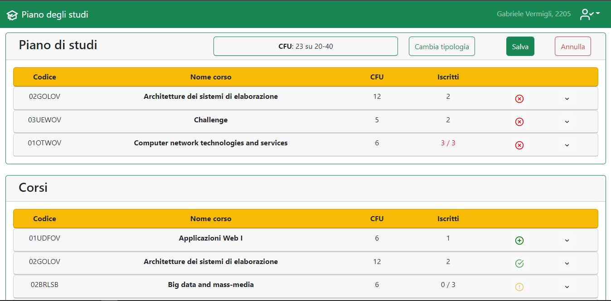

# Exam #1: "Piano degli studi"
## Student: s295740 FEDERICO LUIGI 
---
## React Client Application Routes

- Route `/`:
  - __Purpose__: It contains the list of courses and, if the user is logged in, allows him to view and modify his study plan.
  - __Page content__: 
    - If the user is not logged in, it displays the list of courses offered by the university. These courses can be expanded for more information.
    - If a user is logged in and he does not have an active study plan, it displays a Button to create a new study plan. Then will appear the form to chooese the type of the study plan and then the user will be able to compile his new study plan.
    - If a user is logged in and he has an active study plan, it is shown and it will be possible to modify it.
  - __NOTE__: Some minor components appear as Modal. This is why they don't have their own route.

- Route `/login`:
  - __Purpose__: Allows a user to login.
  - __Page content__: Login form.

***

## API Server

### __Get all courses__

- GET `/api/courses`
  - __Description__: Get the full list of courses.
  - Request parameter: _None_
  - Request body: _None_
  - Response: `200 OK` (success)
  - Response body: Array of objects, each describing one course:
  ``` JSON
  [{
    "id": "02GRZPL",
    "name": "Big data: architectures and data analytics",
    "cfu": 6,
    "signed_up": 0,
    "max_students": 3,
    "preparatory": "01SQJOV",
    "incompatibility": ["02BRLSB", "02CMNSN"]
  },
    ...
  ]
  ```
  - Error responses: `500 Internal Server Error` (generic error)

### __Get a study plan__

- GET `/api/study_plan`
  - __Description__: Get the logged user's study plan.
  - Request parameter: _None_
  - Request body: _None_
  - Response: `200 OK` (success)
  - Response body: Array of course ids:
  ``` JSON
  [
    "02GRZPL",
    "01UDUOV",
    ...
  ]
  ```
  - Error responses: `500 Internal Server Error` (generic error)

### __Create a study plan or update its type__

- PUT `/api/study_plan/:type`
  - __Description__: Modify the user's type attribute. This attribute can only be either equal to NULL (the study plan does not exist) or to 'full-time'/'part-time' (meaning that the study plan exists).
  - Request parameter: type is a string equal to 'full-time' or 'part-time'
  - Request body: _None_
  - Response: `200 OK` (success)
  - Response body: an object containing the new type.
  - Error responses: `422 Unprocessable Entity` (values do not satisfy validators), `503 Service Unavailable` (database error)


### __Delete a study plan__

- DELETE `/api/study_plan/erase`
  - __Description__: Set the user's type attribute to NULL and then delete all the entry of the study plan corresponding to the logged user.
  - Request parameter: _None_
  - Request body: _None_
  - Response: `200 OK` (success)
  - Response body: an empty object
  - Error responses:  `500 Internal Server Error` (generic error)

### __Modify the study plan__
- PUT `/api/study_plan`
  - __Description__ : After checking that the information received from the client is correct and legal, it erases the old study plan and then it inserts a list of courses in the logged user's study plan.
  - Request parameter: _None_
  - Request body: an object containing an array of course ids
  
  ``` JSON
  {
    "courses": [
      "02GRZPL",
      "02BRLSB",
      "02CMNSN",
      ...
    ]
  }
  ```
  - Response: `200 OK` (success)
  - Response body: an empty object
  - Error responses: `422 Unprocessable Entity` (values do not satisfy validators), `503 Service Unavailable` (database error)


### __Login__
- POST `/api/sessions`
  - Description: Authenticate the user who is trying to login
  - Request body: credentials of the user who is trying to login
  
  ``` JOSN
  {
    "usernane: "username",
    "password": "password"
  }
  ```

  - Response: `200 OK` (success)
  - Response body: authenticated user info
  
  ``` JSON
  {
    "id": 2201,
    "username": "mario.rossi@aw1.it",
    "name": "Mario",
    "surname": "Rossi",
    "type": "full-time"
  }
  ```

  - Error responses: `500 Internal Server Error` (generic error), `401 Unauthorized User` (user is not logged in)

### __Check if user is logged in__
- GET `/api/sessions/current`
  - Description: check if the current user is logged in and get his data.
  - Request body: _None_
  - Response: `200 OK` (success)
  - Response body: authenticated user info
    ``` JSON
    {
      "id": 2201,
      "username": "mario.rossi@aw1.it",
      "name": "Mario",
      "surname": "Rossi",
      "type": "full-time"
    }
    ```
  - Error responses: `500 Internal Server Error` (generic error), `401 Unauthorized User` (user is not logged in)


### __Logout__
- DELETE `/api/sessions/current`
  - Description: logout current user
  - Request body: _None_
  - Response: `200 OK` (success)
  - Response body: _None_
  - Error responses: `500 Internal Server Error` (generic error), `401 Unauthorized User` (user is not logged in)

***

## Database Tables

- Table `COURSES` contains the following information about the courses:
  - `id`: course id (primary key, 7 characters long string);
  - `name`: course name (string not null);
  - `cfu`: course cfu (integer not null);
  - `max_students`: maximum number of students who can enroll in the course (integer);
  - `preparatory`: course id of the preparatory course (7 character long string not null);
  - `incompatibility`: string containing the ids of the incompatible courses separated by a comma, es. "02GRZPL,02BRLSB" (string);

- Table `STUDENTS` contains the following information about the users:
  - `id`: student id (primary key, 4 digit long integer);
  - `email`: student username to perform access to the reserved area (email format string not null);
  - `name`: student first name (sting not null);
  - `surname`: student last name (string not null);
  - `type`: represents the state of the study plan. It can assume the following values:
    - _NULL_: it means that the student does not have an active study plan;
    - "full-time": it means that the student has a full-time study plan;
    - "part-time": it means that the student has a part-time study plan;
  - `password`: hashed 64 digit password (string not null);
  - `salt`: 16 digit salt used for the password (string not null);

- Table `STUDY_PLAN` maintains the correlation between students and courses in their study plan. It has the following attributes:
  - `student_id`: student id that has the course 'course_id' in his study plan (primary key, 4 digit long integer);
  - `course_id`: course id in the student's study plan (primary key, 7 characters long string);

***

## Main React Components

- `WrapperCourses` (in `WrapperCourses.js`):
  - __Purpose__: This component is a Card that wraps a list of sub-components Course, both for the anonymous user and for the logged in one (with his study plan)
  - __How it works__:
    - If no user is logged in, this component contains a list of Course components.
    It does the same thing if the user is logged in and we are not in the 'study plan section'.
    - If a user is logged in and we are in the 'study plan section', this component renders the existing study plan as a list of Course components. 
    The user can modify or permanently delete the study plan using the appropriate buttons. If he chooses to modify it, Buttons will appear in the header of the Card to change the type, save the study plan or cancel the operation.

- `Course` (in `Courses.js`):
  - __Purpose__: This component is responsible for displaying the individual courses within the table.
  - __How it works__:
    - It is a Card that contains in the header the id and the name of the course, the cfu and the number of subscribers over the maximum allowed (if this constraint is present). This component can be expanded to display, if any, the preparatory courses and the incompatible courses with the `CourseConstrains` component.
    - If the user has started the study plan modification form, at the end of the main course info will apprear a button (`FormButtons` component). It changes dynamically based on course status: insertable or not, removable or not, already inserted.

- `PlanType` (in `PlanTypeForm.js`):
  - __Purpose__: This component allows the logged in user to choose the type of study plan between 'full-time' and 'part-time'.
  - __How it works__:
    - It is a Modal component that allows the logged in user to choose the type of the study plan. It is shown when the user is creating a new study plan or if he wants to modify the type of the existing one.
  
- `Navigation` (in `Navigation.js`):
  - __Purpose__: Navigation bar.
  - __How it works__: The user can click on the user icon to open the login form (`LoginForm` component will appear in the '/login' route).

## Screenshot



## Users Credentials

- The username to login is the email.

| email                    | password  | type      | id   | name     | surname  |
| ------------------------ | --------- | --------- | ---- | -------- | -------- |
| mario.rossi@aw1.it       | rosso     | full-time | 2201 | Mario    | Rossi    |
| sara.bianchi@aw1.it      | bianco    | part-time | 2202 | Sara     | Bianchi  |
| paolo.verdi@aw1.it       | verde     |           | 2203 | Paolo    | Verdi    |
| alice.gialli@aw1.it      | giallo    | full-time | 2204 | Alice    | Gialli   |
| gabriele.vermigli@aw1.it | vermiglio | part-time | 2205 | Gabriele | Vermigli |
